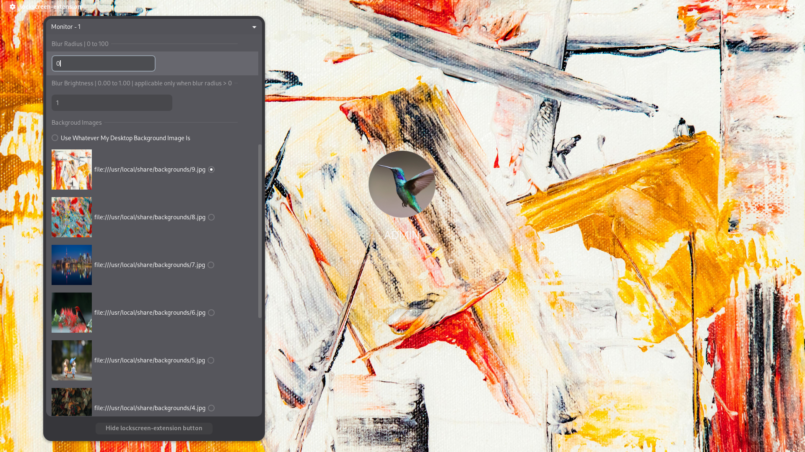
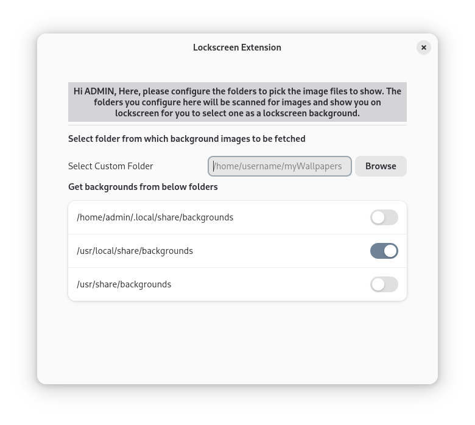

### Gnome Lockscreen Extension (GNOME V42 and above)

___

this extension v9 update.
- removed sliders and used entry box'es for blur-radius and blur-brightness.
- added settings for selecting custom folder from which background images to be picked.
- preview of background images.
- compatible with [variety](https://github.com/varietywalls/variety) app.





Ubuntu 22.04 Screenshots


___

This extension is a improvment of [Control Blur Effect on Lock Screen](https://github.com/PRATAP-KUMAR/control-blur-effect-on-lockscreen) extension.
- With this (lockscreen-extension) you can control blur effect and also set background images or colors in real time.
- You can set different background images/colors for each monitor upto four monitors.

> [!NOTE]
> Currently it is tested on Arch Linux and Ubuntu 22.04, 24.04, 24.10

### Install
```
git clone https://github.com/pratap-panabaka/gse-lockscreen-extension
cd gse-lockscreen-extension
./install.sh
```

> [!TIP]
> After you hide the extension button from the lockscreen, to show it back, run below command
>
> ```
> gsettings --schemadir $HOME/.local/share/gnome-shell/extensions/lockscreen-extension@pratap.fastmail.fm/schemas set org.gnome.shell.extensions.lockscreen-extension hide-lockscreen-extension-button false
> ```

### Uninstall
```
./uninstall.sh
```


```
[admin@Xuxa lockscreen-extension]$ ./uninstall.sh 


	~~~~~~~~~~~~~~~~ lockscreen-extension ~~~~~~~~~~~~~~~~

	running the script...

	------------------------------------------
	| lockscreen-extension is uninstalled |
	------------------------------------------

	~~~~~~~~~~~~~~~~~~ Thank You ~~~~~~~~~~~~~~~~~~


[admin@Xuxa lockscreen-extension]$ ./install.sh 


	~~~~~~~~~~~~~~~~ lockscreen-extension ~~~~~~~~~~~~~~~~

	running the script...

	1. gnome-shell version 47 detected
	2. Creating zip file...
	3. zip file created
	4. Installing the extension from the zip file...

	------------------------------------------
	| lockscreen-extension is installed |
	------------------------------------------

	Now please enable the extension, once extension is enabled then
	You can set background with image(with blur) or color/gradient for each monitor upto 4 monitors independently

	~~~~~~~~~~~~~~~~~~ Thank You ~~~~~~~~~~~~~~~~~~

[admin@Xuxa lockscreen-extension]$ 
```

<hr/>

[](https://www.buymeacoffee.com/pratap.panabaka)


